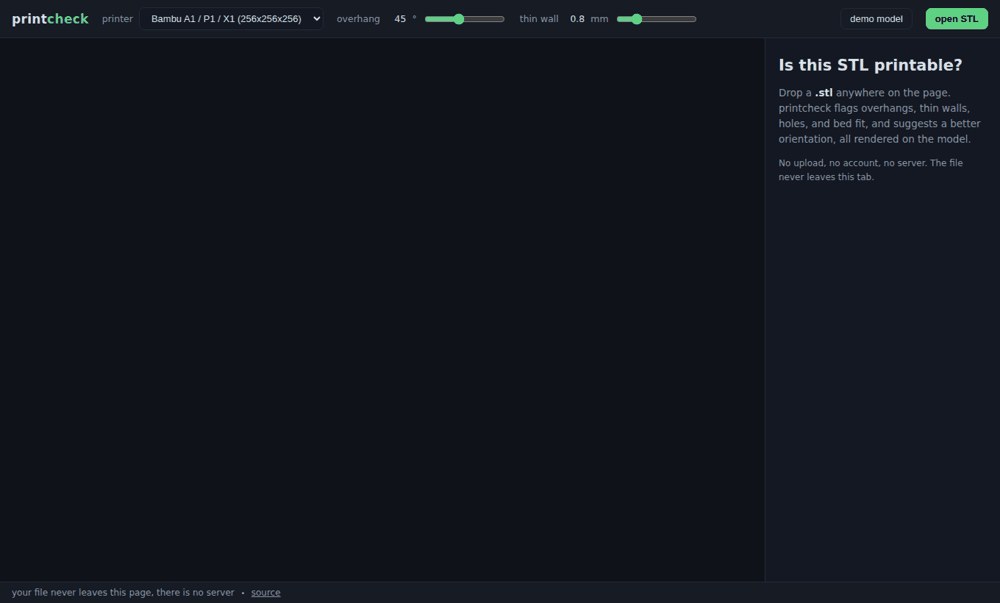

# printcheck

[](https://github.com/keivanmalhani/printcheck/actions/workflows/ci.yml)


English | [Espanol](README.es.md)

**[Try it live](https://keivanmalhani.github.io/printcheck/)** - drop an STL, get answers.



Is this STL printable? Drag one onto the page and see for yourself: overhang faces glow red, thin walls glow amber, open edges glow cyan, and the panel tells you whether it fits your printer, whether the mesh is watertight, and which way to flip it for less support material. Everything runs in your browser. The file never leaves the tab.

## What it checks

| Check | How | Shown as |
| --- | --- | --- |
| Bed fit | bounding box vs printer presets, footprint rotation allowed | pass/fail chip with the overflow per axis in mm |
| Watertightness | every edge must be shared by exactly two triangles | open and non-manifold edge counts, cyan outlines on the model |
| Overhangs | face angle vs the build direction, threshold slider (default 45 deg), bed-contact faces exempt | red faces, surface-area percentage |
| Thin walls | sampled inward raycasts against a spatial grid (default 0.8 mm, slider) | amber faces, labeled a sampled heuristic |
| Orientation | all 24 axis-aligned rotations scored by overhang area with bed fit as a hard constraint | one-click buttons with the overhang delta |
| Stats | dimensions, triangle count, signed-tetrahedra volume, solid PLA weight | model panel |

Parsing is a from-scratch STL reader, binary and ASCII, that ignores stored normals and recomputes them from winding, because exporters lie. Files that start with "solid" but are secretly binary parse fine.

## Privacy

The footer line is the design constraint: **your file never leaves this page, there is no server.** No upload, no account, no analytics, no third-party CDN at runtime, and a CSP meta tag that keeps it that way. Static hosting on GitHub Pages.

## Run it locally

Requires Node 20+.

```bash
git clone https://github.com/keivanmalhani/printcheck.git
cd printcheck
npm install
npm run dev
```

## Development

The geometry core (`src/core/`) is pure TypeScript with zero Three.js imports: parsing, topology, overhangs, thin-wall sampling, bed fit, and orientation scoring are all plain functions over typed arrays, which is what makes them unit-testable without a GPU.

```bash
npm test          # vitest over the geometry core
npm run build     # type-check plus production build
```

Regenerate the README screenshots from the built app:

```bash
node scripts/screenshots.mjs
```

## Honest limitations

- The thin-wall check samples up to 3,000 faces. A clean pass means nothing thin was found among the samples, not a proof.
- Volume and weight assume a solid part; your slicer's infill will print lighter.
- Orientation advice only considers the 24 axis-aligned flips, which is what you would try by hand in a slicer. It does not generate supports or slice anything.
- Detection only, never repair: printcheck reports holes, it does not patch them.

## Roadmap

- STEP down the analysis into a web worker for very large meshes
- 3MF and OBJ input
- Per-region support volume estimate
- Shareable permalink of the verdict (still zero server: encoded in the URL)

## License

MIT, see [LICENSE](LICENSE).
